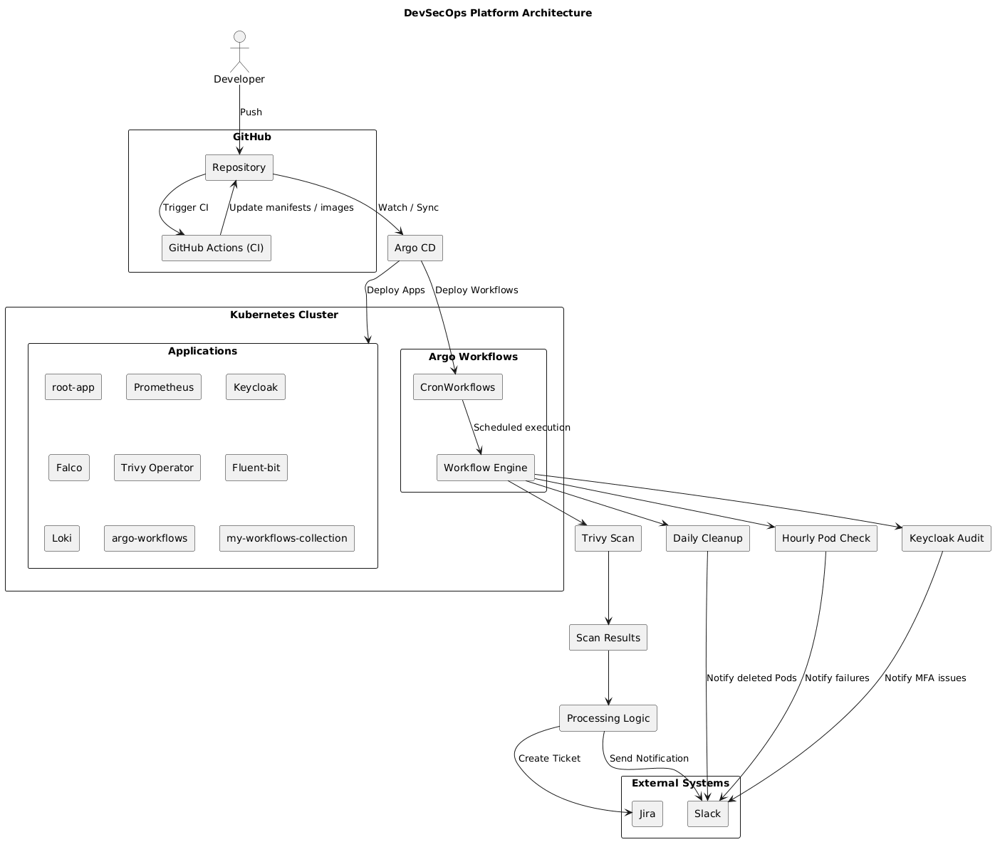
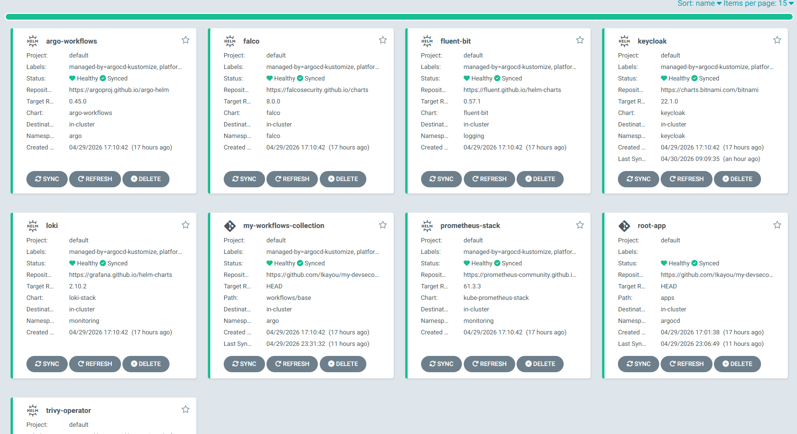
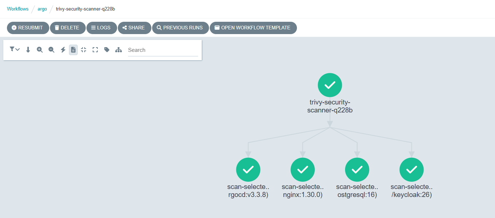
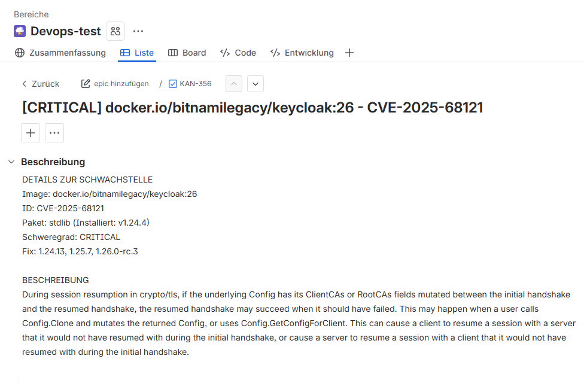
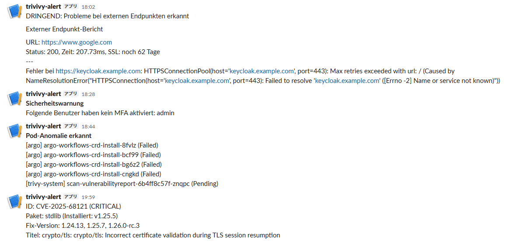
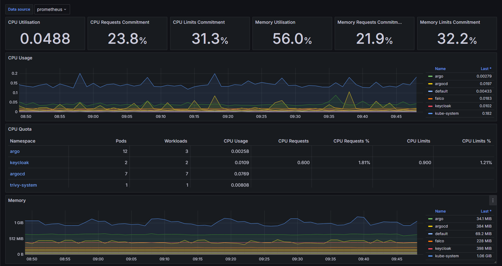
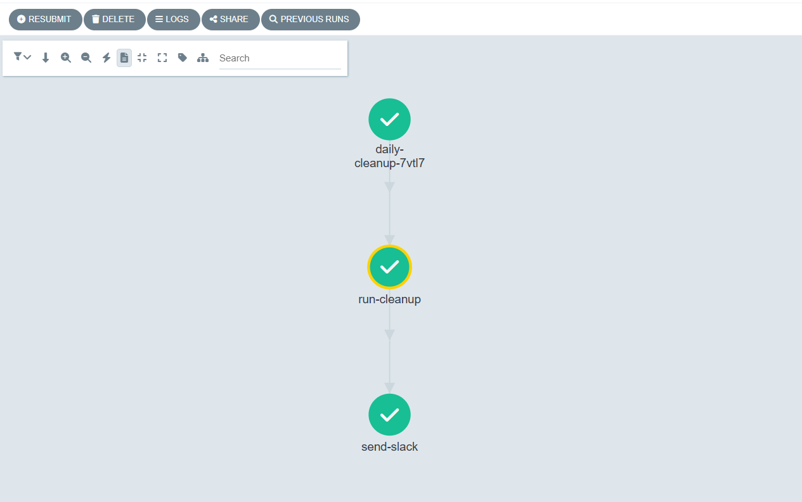
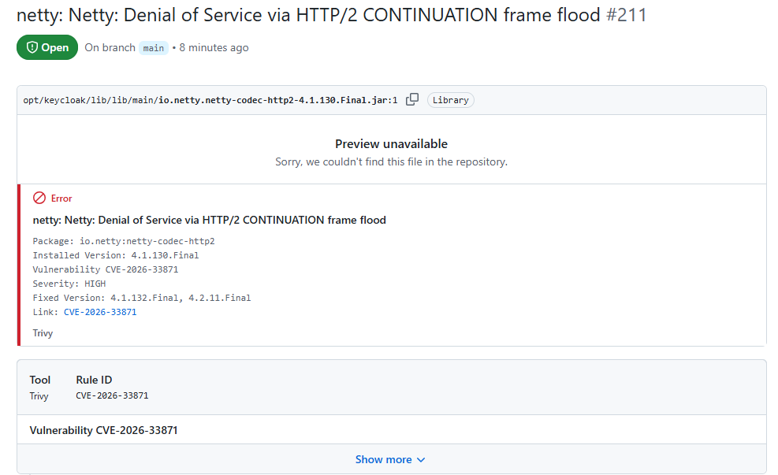

# DevSecOps Plattform auf Kubernetes

***Automatisierung von Deployment, Security und Monitoring**

## Übersicht

Eine vollständige DevSecOps-Plattform mit:

- CI/CD (GitHub Actions + ArgoCD)
- Security Scanning (Trivy)
- Automatisiertem Incident Management (Jira + Slack)
- Kubernetes-basierter Infrastruktur

## Architektur



## Demo

- Trivy Scan erkennt CVEs automatisch
- Jira Tickets werden bei kritischen Findings erstellt
- Slack Benachrichtigung bei Security Events
- ArgoCD synchronisiert alle Deployments automatisch

## Projektstruktur

```text
my-devsecops-platform/
├── .github/                    # CI/CD Konfiguration
│   └── workflows/
|       └── trivy-scan.yaml     # GitHub Action für automatisiertes Security Scanning
├── apps/                       # Infrastruktur-Komponenten (GitOps-Apps)
│   ├── keycloak/               # Identity & Access Management (IAM)
│   │   ├── base/               # Grundkonfiguration (App-Definition, Network Policies)
│   │   └── overlays/           # Umgebungsspezifische Anpassungen
│   │       └── dev/            # Dev-Umgebung inkl. verschlüsselter Slack-Anbindung
│   ├── argo-workflows/         # Engine für die Workflow-Automatisierung
│   ├── falco/                  # Runtime Security & Bedrohungserkennung
│   ├── fluent-bit/             # Log-Shipper für die Datensammlung
│   ├── loki/                   # Log-Aggregationssystem (Teil des PLG-Stacks)
│   ├── prometheus/             # Monitoring- & Alerting-System
│   └── trivy/                  # Kubernetes-Operator für In-Cluster Scans
├── bootstrap/                  # Einstiegspunkt für GitOps
│   └── root-app.yaml           # "App-of-Apps" zur automatischen Cluster-Initialisierung
├── workflows/                  # Operative Automatisierung (Argo Workflows)
│   ├── base/                   # Gemeinsame Vorlagen und RBAC-Berechtigungen
│   │   ├── cron-workflows/     # Zeitgesteuerte Aufgaben (Cleanup, Audits)
│   │   └── template/           # Wiederverwendbare Workflow-Bausteine
│   └── overlay/                # Umgebungsspezifische Parameter & Secrets
│       └── sealed-slack-secret.yaml # Verschlüsselte Webhooks für Statusmeldungen
├── images/                     # Custom Docker-Engineering
│   └── trivy-scanner/          # Eigener Python-basierter Security-Scanner
│       └── Dockerfile          # Bauplan für das Custom Scan-Image
├── bilder/                     # Speicherort für Screenshots der Dokumentation
└── README.md                   # Zentrale Dokumentation der Plattform

```

## Kern-Funktionen

### 1. GitOps & Automatisierung

***Argo CD & Root-App**: Die gesamte Plattform wird über eine `root-app.yaml` gesteuert. Sobald ich Änderungen nach GitHub pushe, synchronisiert Argo CD den Cluster automatisch.
***Strukturierte Konfiguration**: Ich nutze **Kustomize** mit `base` und `overlays`. Das macht die Konfiguration modular und bereit für verschiedene Umgebungen (z. B. Dev und Produktion).
***Sichere Secrets**: Passwörter werden mit **Sealed Secrets** verschlüsselt. So können sie sicher im öffentlichen Git-Repository gespeichert werden.



### 2. Security & Incident Management

***Automatisierte Scans**: Ein spezialisierter **Trivy-Scanner** (basiert auf Python 3.9-slim) prüft die Applikationen regelmäßig auf Schwachstellen.



***Smart Ticketing**: Findet der Scanner kritische Fehler, prüft ein Skript automatisch in **Jira**, ob das Problem bekannt ist. Falls nicht, wird ein Ticket erstellt und eine **Slack-Warnung** gesendet.





***Compliance-Check**: Ein Workflow prüft in **Keycloak**, ob alle Benutzer die Multi-Faktor-Authentifizierung (MFA) aktiviert haben.

### 3. Monitoring & Plattform-Betrieb

***Echtzeit-Überwachung**: Mit **Prometheus, Grafana, Loki und Falco** werden Metriken, Logs und Sicherheits-Events zentral visualisiert.



***Verfügbarkeit**: Ein **SSL-Monitor** prüft die Gültigkeit von Zertifikaten und meldet Ablaufdaten proaktiv an Slack.
***Self-Healing**: Ein Workflow erkennt abgestürzte Pods sofort. Zudem bereinigt ein automatischer **Cleanup-Workflow** täglich alte Daten, um Ressourcen zu sparen.



### 4. Security Scanning



- Trivy wird in der CI-Pipeline ausgeführt und scannt Container-Images automatisch
- Ergebnisse werden im GitHub Security Tab (SARIF) visualisiert
- Kritische Schwachstellen werden weiterverarbeitet:
  - automatische Erstellung von Jira-Tickets
  - Benachrichtigung über Slack

---

## Warum dieser Aufbau?

***Spezialisierte Images**: Der `trivy-scanner` wurde bewusst als schmales Python-Image gebaut, um die Angriffsfläche klein zu halten und nur nötige Funktionen (Jira/Slack API) zu enthalten.
***Shift-Left**: Durch die Integration von **GitHub Actions** werden Sicherheitslücken bereits erkannt, bevor die Software installiert wird.

## Lernergebnisse

*Sicherer Betrieb von Kubernetes-Clustern durch GitOps-Prinzipien.
*Automatisierung komplexer Arbeitsabläufe mit **Argo Workflows**.
*Praktische Erfahrung in der Verknüpfung von Security-Tools mit Enterprise-Systemen wie Jira und Slack.

---
